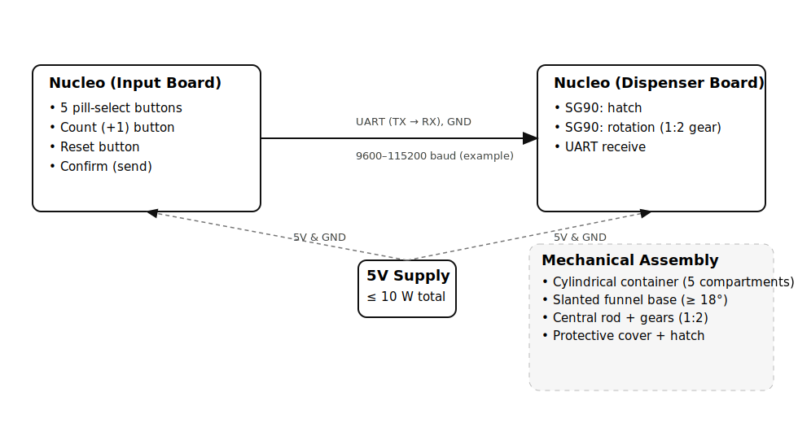
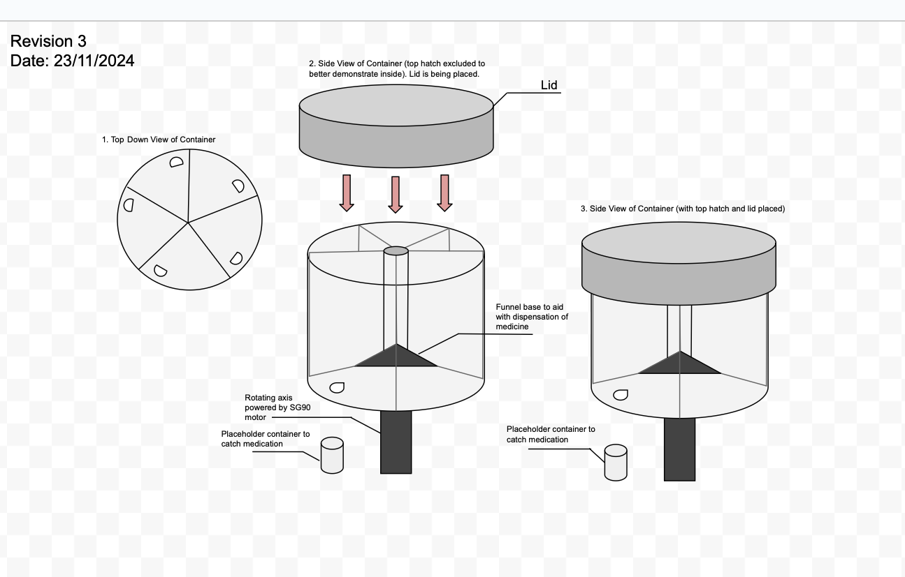
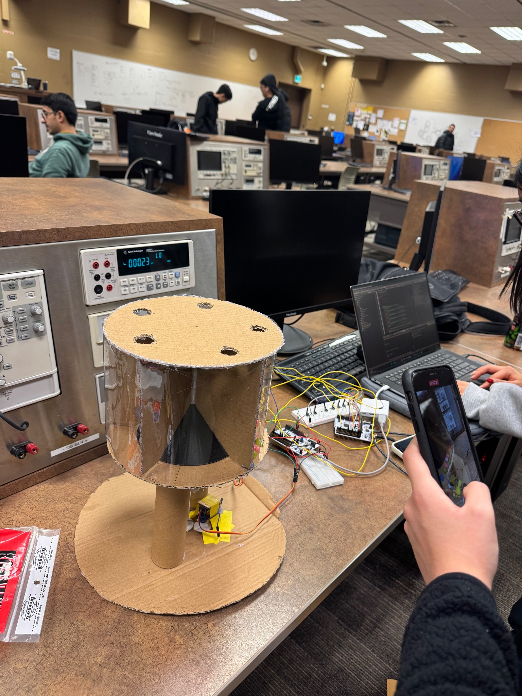

# 💊 Automated Medicine Dispenser

[]()
[](LICENSE)

An embedded **medicine dispenser** using two STM32 Nucleo-F401RE boards (UART), a **servo-driven** rotating mechanism, and a **hatch** for timed dispensing.

## 🗺️ System Diagram


## 💡 Idea Sketch


## 📦 Repo Structure
```
hardware/      CAD + circuits
firmware/      Board projects (input & dispenser)
docs/          Design report, test plan, manuals
media/         Photos, diagram, demo video
```

## ⚙️ Build & Flash (STM32CubeIDE)
1. Clone repo and open **STM32CubeIDE**.
2. Import `firmware/uart_controller` and `firmware/motor_driver` as existing projects.
3. Set toolchain to **Debug** (or Release), then **Build**.
4. Connect each Nucleo-F401RE via USB and **Run → Debug** (or **Run**) to flash.

### UART (example settings)
- Baud: 115200, 8N1
- Wire **GND–GND**, **TX(Board1) → RX(Board2)**
- Distance: 1–15 m (project spec)

## 🔌 Pins (example — adjust for your boards)
**Input Board**
- Buttons: PB0..PB7 (w/ 10 kΩ pulldowns)
- UART TX: PA2, RX: PA3 (typical)

**Dispenser Board**
- Servo (hatch): PB6 (PWM)
- Servo (rotation): PB7 (PWM)
- UART RX: PA3, TX: PA2

## ▶️ Demo Video (inline)
<!-- GitHub can render .mov; include HTML video tag for inline playback -->
<video src="media/Test.mov" width="640" controls></video>

If your browser doesn’t autoplay inline, download: [Test.mov](media/Test.mov)

## 📸 Prototype


## 🔌 Circuit Diagram


## 🧪 Tests
- Communication ≥ 1 m
- Each of 5 compartments dispenses
- Accuracy within ±1 pill
- Supports 1–22 mm pills
- Total time < 10 min

## 🧰 Hardware & Tools
| Component | Model | Quantity | Function |
|------------|--------|-----------|-----------|
| Microcontroller | STM32 Nucleo-F401RE | 2 | Control & communication |
| Servo Motor | SG90 | 2 | Hatch & rotation control |
| Push Buttons | 6x6mm DIP | 8 | User input interface |
| Power Adapter | 5V DC | 1 | Power supply |
| Material | Polycarbonate (3D printed) | — | Mechanical structure |
| Software | AutoCAD, SolidWorks, STM32CubeIDE, Fritzing | — | Design & implementation |

## 📚 Docs
- Design Document: see `docs/` (add PDF version when ready)
- Test Plan: `docs/Test_Plan.md`

## 🚀 Future Improvements
- LCD display for scheduling and feedback
- BLE/Wi‑Fi companion app
- Stepper motor + home sensor
- Injection‑molded enclosure

## 🏁 License
MIT License © 2025 – Tina Yaghchian
